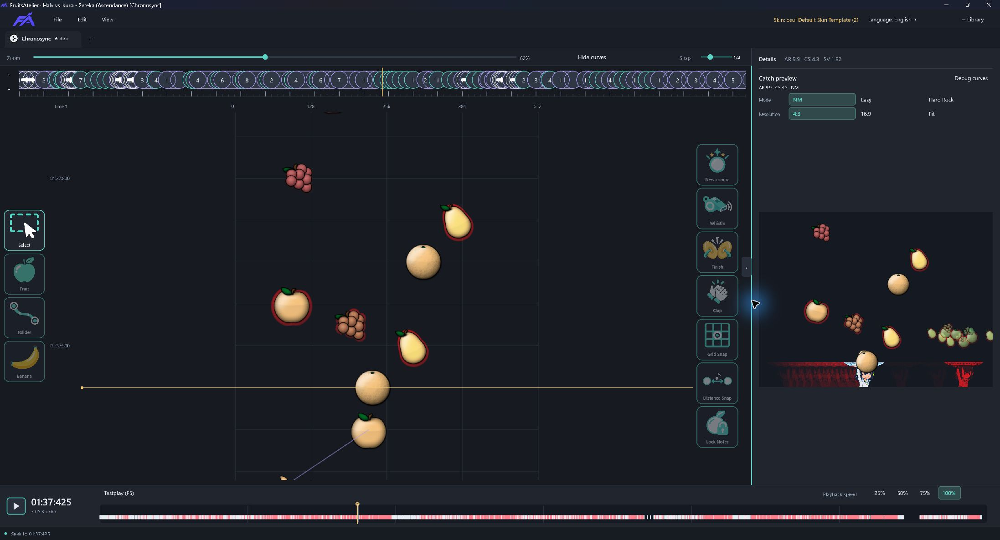

# FruitsAtelier


[English](README.md) | [简体中文](README.zh-CN.md) | **日本語** | [한국어](README.ko.md)

Windows と macOS 向けの独立した osu!catch ビートマップエディターです。曲を選び、パターンを作り、試しにプレイするまでを、ひとつのワークスペースで行えます。

[公式サイト](https://fruitsatelier.himiko.moe/) · [ダウンロード](https://github.com/frankhjwx/FruitsAtelier/releases/latest) · [Discord](https://discord.gg/Dwe7bshYHY) · [Himiko の osu! プロフィール](https://osu.ppy.sh/users/1806962)

**現在のバージョン：0.9.9**



*Σvreka — Halv vs. kuro · Ascendance [Chronosync]。画像内のビートマップとスキンのアートワークは、それぞれの制作者に帰属します。*

## 次の Catch ビートマップを作ろう

- **ライブラリから始める。** osu!stable の Songs を閲覧・検索し、フォルダーや `.osz` をインポートできます。保存済みのプロジェクトを開き、タブで複数の難易度を切り替え、スター評価を確認できます。
- **パターンを直接編集。** フルーツやバナナシャワーを配置し、選択したオブジェクトを移動・複製・左右反転・削除できます。元に戻す・やり直しにも対応。制御点やベジェハンドルで FSlider を描き、折り返しの追加、インポートしたスライダーの変換、パスからのフルーツストリーム生成ができます。
- **配置とタイミングを調整。** 拍の分割、水平グリッド、距離スナップを使えます。赤線・緑線の編集、タップによるテンポ設定、オブジェクトの再スナップ、メトロノームに対応。新しいコンボやヒットサウンド、各スライダー端点のサウンドも設定できます。
- **音楽を聴き、確認して、テストプレイ。** MP3・OGG・WAV とヒットサウンドを 10%・25%・50%・75%・100%・150% の速度で再生できます。NM・Easy・Hard Rock のプレビューや、現在位置からのテストプレイに対応。移動キーの変更、ダッシュ、コンボ表示、オートプレイも使えます。
- **好みのスキンと言語を使用。** osu!stable のスキンを読み込むか、`.osk` をインポートできます。UI は英語、簡体字中国語、繁体字中国語、日本語、韓国語、ロシア語、スペイン語、フランス語、ポーランド語、オランダ語、フィリピン語、インドネシア語、タイ語に対応しています。
- **プロジェクトを保存してエクスポート。** 編集可能なスライダーと難易度のデータを保存し、`.osu` を出力したり、osu!stable に新しい難易度を追加したりできます。

Catch の `.osu` は v12–v14 と stable 互換の lazer v128 を読み込み、v14 で出力します。0.9 では動画とストーリーボードの再生に対応していません。

## はじめに

### Windows

1. [Releases](https://github.com/frankhjwx/FruitsAtelier/releases/latest) から Windows x64 ZIP をダウンロードします。
2. ZIP 全体を展開し、`FruitsAtelier.exe` を起動します。展開したファイルは同じフォルダーに保管してください。.NET は同梱されています。Windows 10/11 と DirectX 11 が必要です。
3. 初回起動時のガイドで、フォルダー、言語、スキン、オーディオ、テストプレイを設定します。これらの項目は**ライブラリ > 設定**でも変更できます。
4. ビートマップをインポートするか新しいプロジェクトを作成し、難易度を開いて編集を始めます。

### macOS

ソースからのビルドには .NET SDK **8.0.419** と Xcode Command Line Tools が必要です。リポジトリのルートで実行してください。

```bash
bash scripts/Install-Mac-SDK.sh
./Run-Editor-Mac.command
```

`bash scripts/Publish-Mac.sh` で単体のアプリを作成できます。詳しくは [macOS ガイド（英語）](docs/MACOS.md)を参照してください。

## 使い方とコミュニティ

[ユーザーマニュアル（英語）](docs/USER_MANUAL.md)では、設定、編集、保存、テストプレイを説明しています。[キーボード・マウス操作一覧（英語）](docs/KEY_BINDINGS.md)で全操作を確認できます。

エクスポートで難易度とファイルを関連付けた後は、**Ctrl+S で関連付けられた `.osu` も更新されます**。**Ctrl+Alt+E** でエクスポートの選択肢を開きます。

[Discord](https://discord.gg/Dwe7bshYHY) に参加して、アルファ版のテストやフィードバックにご協力ください。不具合は [GitHub Issues](https://github.com/frankhjwx/FruitsAtelier/issues) へ報告できます。[Himiko の osu! プロフィール](https://osu.ppy.sh/users/1806962)からも連絡できます。

## 開発

C# 12 と .NET 8 を使用しています。Windows のソースビルドには `global.json` で指定された SDK **10.0.400** を使用します。[Run-Editor.cmd](Run-Editor.cmd) でビルドして起動できます。macOS のスクリプトは `macOS/` 配下で指定された SDK を使用します。

- [ビルドとテスト](docs/TESTING.md) · [パッケージ作成とリリース](docs/RELEASING.md)
- [編集操作](docs/EDITOR_UI.md) · [ワークスペースとファイル](docs/WORKSPACE.md)
- [アーキテクチャ](docs/ARCHITECTURE.md) · [プロジェクトモデル](docs/PROJECT_MODEL.md) · [ファイル形式](docs/STABLE_FORMAT.md)
- [ローカライズ](docs/LOCALIZATION.md) · [サードパーティのライセンス](THIRD_PARTY_NOTICES.md)

技術文書とユーザーマニュアルは英語で管理しています。
