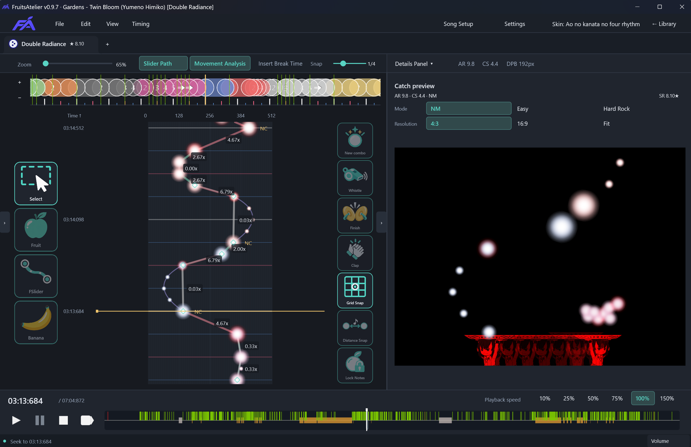

# FruitsAtelier


[English](README.md) | [简体中文](README.zh-CN.md) | **日本語** | [한국어](README.ko.md)

Windows と macOS 向けの独立した osu!catch ビートマップエディターです。曲を選び、パターンを作り、試しにプレイするまでを、ひとつのワークスペースで行えます。

[公式サイト](https://fruitsatelier.himiko.moe/) · [ダウンロード](https://github.com/frankhjwx/FruitsAtelier/releases/latest) · [Discord](https://discord.gg/Dwe7bshYHY)

**現在のバージョン：0.9.9**



*Gardens — Twin Bloom · Yumeno Himiko [Double Radiance]。*

## 次の Catch ビートマップを作ろう

- **ライブラリから始める。** osu!stable の Songs を閲覧・検索し、フォルダーや `.osz` をインポートできます。保存済みのプロジェクトを開き、タブで複数の難易度を切り替え、スター評価を確認できます。
- **パターンを直接編集。** 横軸が Catch の位置、縦軸が時間を表すキャンバスで、フルーツやバナナシャワーを配置できます。表示の移動・ズーム、選択したオブジェクトの移動・複製・左右反転・削除、元に戻す・やり直しに対応しています。
- **タイミングとヒットサウンドを調整。** 赤線・緑線の編集、タップによるテンポ設定、オブジェクトの再スナップ、メトロノームに対応。新しいコンボや各スライダー端点のサウンドも設定できます。Hitsound Copier（Beta）では、適用前に結果を確認して別の難易度からサウンドをコピーできます。
- **音楽を聴き、確認して、テストプレイ。** MP3・OGG・WAV とヒットサウンドを 10%・25%・50%・75%・100%・150% の速度で再生できます。NM・Easy・Hard Rock のプレビューや、現在位置からのテストプレイに対応。移動キーの変更、ダッシュ、コンボ表示、オートプレイも使えます。
- **好みのスキンと言語を使用。** osu!stable のスキンを読み込むか、`.osk` をインポートできます。UI は英語、簡体字中国語、繁体字中国語、日本語、韓国語、ロシア語、スペイン語、フランス語、ポーランド語、オランダ語、フィリピン語、インドネシア語、タイ語に対応しています。
- **プロジェクトを保存してエクスポート。** 編集可能なデータを保存し、`.osu` の難易度や `.osz` のマップセットを出力できます。関連付けた難易度を osu!stable と同期し、外部の変更による競合を確認できます。バージョン履歴から保存済みの難易度を復元することもできます。

## Catch のためのツール

- **FSlider。** 制御点やベジェハンドルで、時間に沿った水平移動を直接描けます。折り返しの追加や、インポートした Legacy Slider の変換にも対応。通常の osu! スライダーとして出力され、編集可能な曲線はプロジェクトに保存されます。
- **ドロップレットを直接編集。** スライダー内のフルーツやドロップレットを個別に選択し、横にドラッグするか X 座標を入力できます。グリッド・距離スナップで間隔を調整できます。
- **ランダム化とランダム化の補正。** NM または HR 向けに TinyDroplet のランダムな位置ずれを補正するか、ランダム化の強度とシードを設定できます。HR 向けに補正した場合は、両方のプレビューで結果を確認できます。
- **DPB と距離スナップ。** Distance Per Beat（1 拍あたりの距離）を水平間隔の基準として設定し、最大 8 個の距離プリセットを同時に使えます。ビートスナップは時間、グリッドスナップは水平位置を揃えます。
- **移動表示と分析。** 前後のオブジェクトとの間隔を読み取り、Stand・Walk・Dash・Hyperdash の接続をキャンバスで確認できます。曲全体の Movement strain グラフから負荷の高い区間へ移動できます。AiMod はオブジェクトの開始時刻の重複を検出します。
- **編集可能なストリームとスタック。** 曲線に沿って指定の拍分割でフルーツを生成したり、幅の変化を設定して左右交互のスタックを作成したりできます。親曲線や個別のフルーツを編集し、独立したフルーツに分割することもできます。どちらも hit circle として出力されます。

Catch の `.osu` は v12–v14 と stable 互換の lazer v128 を読み込み、v14 で出力します。0.9 では動画とストーリーボードの再生に対応していません。

## はじめに

### Windows

1. [Releases](https://github.com/frankhjwx/FruitsAtelier/releases/latest) から Windows x64 ZIP をダウンロードします。
2. ZIP 全体を展開し、`FruitsAtelier.exe` を起動します。展開したファイルは同じフォルダーに保管してください。.NET は同梱されています。Windows 10/11 と DirectX 11 が必要です。
3. 初回起動時のガイドで、フォルダー、言語、スキン、オーディオ、テストプレイを設定します。これらの項目は**ライブラリ > 設定**でも変更できます。
4. ビートマップをインポートするか新しいプロジェクトを作成し、難易度を開いて編集を始めます。

更新機能に対応したインストールでは、**設定 > アプリの更新 > 更新を確認**からダウンロードし、保存して再起動できます。プロジェクトとカスタムスキンは、アプリの `current/` フォルダーの外に置いてください。

### macOS

ソースからのビルドには .NET SDK **8.0.419** と Xcode Command Line Tools が必要です。リポジトリのルートで実行してください。

```bash
bash scripts/Install-Mac-SDK.sh
./Run-Editor-Mac.command
```

`bash scripts/Publish-Mac.sh` で単体のアプリを作成できます。詳しくは [macOS ガイド（英語）](docs/MACOS.md)を参照してください。

## 使い方とコミュニティ

[ユーザーマニュアル（英語）](docs/USER_MANUAL.md)では、設定、編集、保存、テストプレイを説明しています。[キーボード・マウス操作一覧（英語）](docs/KEY_BINDINGS.md)で全操作を確認できます。

エクスポートで難易度とファイルを関連付けた後は、**Ctrl+S で関連付けられた `.osu` も更新されます**。**Ctrl+Alt+E** でエクスポートの選択肢を開きます。

ワークスペースの `.catchdiff` に編集データを保存します。旧形式の `.catchproj` も開けます。プロジェクトフォルダー全体と参照する素材を保管してください。バージョン履歴ではスナップショットを比較し、難易度を復元できます。保持期間は通常 30 日、各プロジェクトは 100 ラウンドまでです。詳しくは[同期と復元（英語）](docs/SYNCHRONIZATION.md)を参照してください。

[Discord](https://discord.gg/Dwe7bshYHY) に参加して、アルファ版のテストやフィードバックにご協力ください。不具合は [GitHub Issues](https://github.com/frankhjwx/FruitsAtelier/issues) へ報告するか、[osu! で私に連絡](https://osu.ppy.sh/users/1806962)してください。

## 開発

C# 12 と .NET 8 を使用しています。Windows のソースビルドには `global.json` で指定された SDK **10.0.400** を使用します。[Run-Editor.cmd](Run-Editor.cmd) でビルドして起動できます。macOS のスクリプトは `macOS/` 配下で指定された SDK を使用します。

- [ビルドとテスト](docs/TESTING.md) · [パッケージ作成とリリース](docs/RELEASING.md)
- [編集操作](docs/EDITOR_UI.md) · [ワークスペースとファイル](docs/WORKSPACE.md)
- [アーキテクチャ](docs/ARCHITECTURE.md) · [プロジェクトモデル](docs/PROJECT_MODEL.md) · [ファイル形式](docs/STABLE_FORMAT.md)
- [ローカライズ](docs/LOCALIZATION.md) · [サードパーティのライセンス](THIRD_PARTY_NOTICES.md)

技術文書とユーザーマニュアルは英語で管理しています。

## クレジットとライセンス

- [ppy/osu](https://github.com/ppy/osu) — osu!catch のアルゴリズムと、変換・ゲームプレイ・難易度計算・互換性に関する動作の参考。
- [Exsper/osucatch-editor-realtimeviewer](https://github.com/Exsper/osucatch-editor-realtimeviewer) — マッピング中のリアルタイム Catch プレビューの着想。
- [Phob144/DropletDerandomizer](https://github.com/Phob144/DropletDerandomizer) — ドロップレットのランダム化補正と Catch スライダーパターン作成の着想。

FruitsAtelier 独自のソースコードは [MIT ライセンス](LICENSE)で公開しています。第三者のコードと素材は、それぞれのライセンスを保持します。帰属表示と保存されたライセンス文書は[サードパーティの通知](THIRD_PARTY_NOTICES.md)を参照してください。同梱の CC BY-NC 4.0 の osu! リソースには非営利の制限が引き続き適用され、SoundTouch.Net は LGPL-2.1-or-later のままです。
